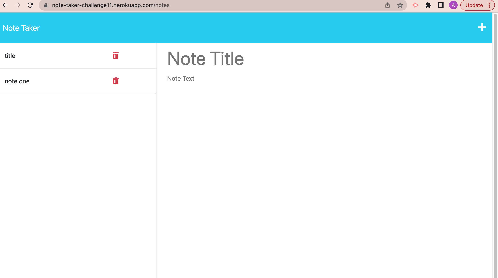
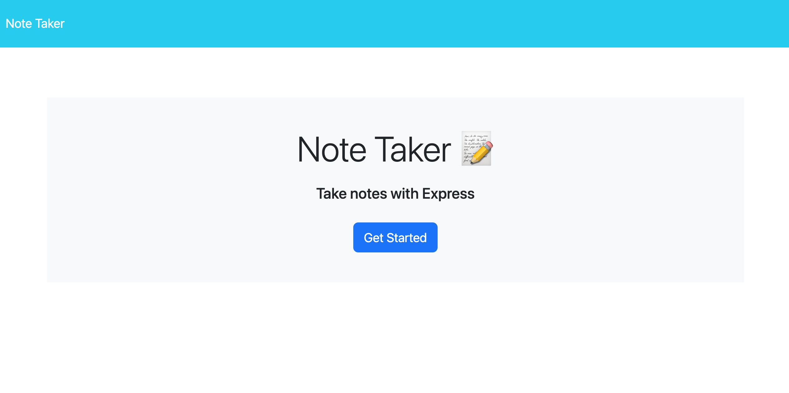

# note-taker

## Description

This application allows the user to enter notes and as they save, they appear in the sidebar on the left. Notes can be deleted by clicking the trash can next to the corresponding note.

## Badges

### User Story

  - AS A small business owner
  - I WANT to be able to write and save notes
  -  SO THAT I can organize my thoughts and keep track of tasks I need to complete

### Acceptance Criteria

  - GIVEN a note-taking application
  - WHEN I open the Note Taker
  - THEN I am presented with a landing page with a link to a notes page
  - WHEN I click on the link to the notes page
  - THEN I am presented with a page with existing notes listed in the left-hand column, plus empty fields to enter a new note title and the note’s text in the right-hand column
  - WHEN I enter a new note title and the note’s text
  - THEN a Save icon appears in the navigation at the top of the page
  - WHEN I click on the Save icon
  - THEN the new note I have entered is saved and appears in the left-hand column with the other existing notes
  - WHEN I click on an existing note in the list in the left-hand column
  - THEN that note appears in the right-hand column
  - WHEN I click on the Write icon in the navigation at the top of the page
  - THEN I am presented with empty fields to enter a new note title and the note’s text in the right-hand column

### Screenshots

 
  
## Installation

  1- Run npm install
  2- Run Node server.js
  3- either deploy to heroku or type into search bar localhost:3001
  https://note-taker-challenge11.herokuapp.com/notes
  
 ## Usage
 
 This is a challenge designed by the University of Washington bootcamp to showcase the learning and understanding of coursework.
 
 ## License
[Read MIT License](https://opensource.org/licenses/MIT)
